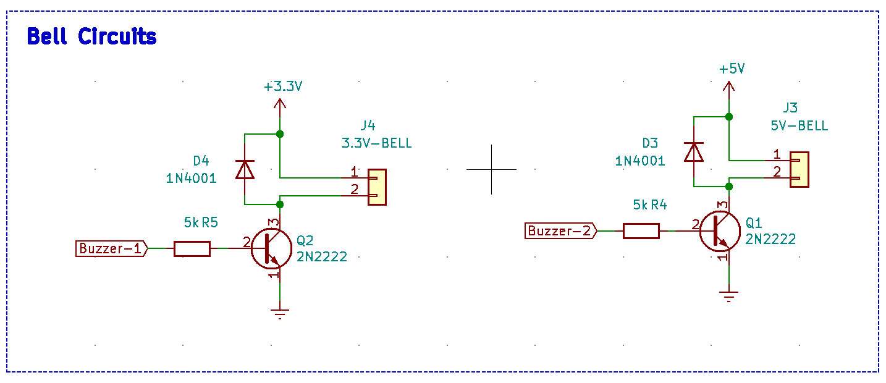

# **SMART DOORBELL**

## Summery
A traditional doorbell requires the visitor to physically touch the device in order to inform the house owner. This could also result in people getting electrocuted due to current leakages in doorbells, as most of them are fixed in an open place outside the house. Also in a traditional doorbell, the house owner does not have the chance to check the visitor prior to opening the door. To address these issues, we came up with the idea of developing a ‘Smart Doorbell’. Starting with just the idea in mind, we as a team, first brainstormed on what current issues we need to address through our design while doing a full analysis on the current products in the market. During the research, we identified that there are several types of doorbells with different features in the market: such as - Video facility, 2 - way talk, voice commands. When analysing the price ranges, these upgraded versions came with a comparatively high price tag. Hence we prioritized the key features we needed to have in our design, to make it more cost-effective and customer friendly. The key features of our design: Touchless, Wifi-connected, Built-in camera, LCD Display, backup power system, User mobile application. The ‘Smart Doorbell’ mainly consists of three components. Sensor box (should be placed at door), Bell box (should be placed inside the house) and the mobile application which gives access to the user to monitor what happens when he/she gets a visitor. The working principle of the ‘Smart Doorbell’ can be described as, if someone is waiting in front of the house (within the range of the sensor box), it would send a signal to the bell so that the bell would ring with the visitor not having to put any effort ringing the bell, so even for a visitor who has no idea how this device works, will not face any issues in notifying the house owner regarding his/her arrival. Through the LCD display, he/she will be able to get informed regarding the currently ongoing process. In the meantime, the user also can check the visitor using the picture he receives through the mobile application and can make the decision whether to open the door or not easily without the visitor noticing. In a scenario, if the user is returning to the house, to avoid the bell ringing, he/she can choose to cancel the operation using the Main Button. Since our design can connect to the main power supply of the house, there will be no changes the users have to make in order to set up this new device for their households. In addition to that, this doorbell is capable of functioning even without the main supply since it contains a self-charging backup battery system. So far, we have been able to successfully design and manufacture the PCBs for sensor boxes and the bell box and soldered all the necessary components except the backup power circuit. Also, we successfully read the data from the PIR sensor, established communication between the inbuilt camera and the microcontroller, wrote the code needed to operate the LCD, code required to set up the device through the mobile app from which we were able to successfully send notifications to the user’s phone. Furthermore, there are few parts we could not complete fully; the backup power circuit is not soldered in the PCB, so it’s not being tested. Also, this PCB was tested without a door sensor. Even though the Prototype is working, we could not test the system in real-life scenarios. As for future recommendations, we would suggest customization of LCD display text, user to receive the text even if online, using a smaller MCU in the bell box and using a secure server instead of FTP protocol.

## **1. Introduction** 

We all have doorbells in our households, and we have been facing a lot of issues related to the functioning method of these traditional doorbells for a long time. Sometimes without even noticing. Two of such scenarios are people might get electrocuted due to current leakages in doorbells and having to physically touch the device also, house owners do not have the chance to check the visitor prior to opening the door. This smart doorbell is capable of providing solutions to many more issues like these and we can take this to commercial production and selling level with future development. This doorbell mainly consists of three components. Sensor box (should be placed at door), bell box (should be placed inside the house) and the mobile application which gives access to the user to monitor what happens when he/she gets a visitor. Sensor box and bell box communicate wirelessly. In the next sections of this report, we will be discussing each of these components in detail and go through the design process as well.

## **2. Analysis** 

### **2.1 Project Background** 

Since we personally experience the issues regarding traditional doorbells, it is much easier to understand the background of the task and perform accordingly to overcome such issues. Other than that, we had the privilege to get ideas from any set of people since these issues are common and everyone experiences these in daily life. It was encouraging that we did not have to do much work on understanding the issue and solutions that are required and researching regarding the technology needed to complete the task. Since our design has features that are rare to find in the current market of smart doorbells it might be easier to market this doorbell if we take this to the commercial production level with some improvements. If we go through the features of our smart doorbell, mainly it is touchless and any visitor who has no idea how this device works, will not face any issue to notify the house owner regarding his/her arrival. Through the LCD display he/she will be able to get informed regarding the currently ongoing process. In the meantime, the user also can check the visitor using the picture he receives through the mobile application and can make the decision whether to open the door or not easily without the visitor noticing. Since our new design can connect to the main power supply of the house, there will be no changes the users have to make in order to set up this new device for their households. In addition to that, this doorbell is capable of functioning even without the main supply since it contains a self-charging backup battery system. For a country like Sri Lanka which often experiences power breakdowns, this feature is quite useful. Overall, this smart doorbell makes it easier to handle the situation of someone’s arrival at your house, for both user and the visitor without any major maintenance requirements as well.

### **2.2 Design Requirements** 

The following images show the final prototype made for the project.

**2.2.1 Sensor Box**

* PIR sensor is used to detect any presence of humans. It uses IR radiation from the human body to sense humans.
* An LCD display is used to display any messages to the user.
* The NRF24L0 module is used to communicate between the sensor box and the bell box
* ESP32CAM module is used as the main camera. It also comes with an ESP32 chip, which gives WiFi accessibility to the sensor box.
* A door sensor is used to direct whether the door is open or closed. This is a magnetic sensor that is fixed to the door.
* STM32F103C8T6 ic is used as the main MCU of the sensor box. This is an ARM Cortex M3 microcontroller. It has a clock speed of 72MHz which is higher than the normal Arduino board

**2.2.2 Bell Box**

* Bell box uses Atmega 328p as its main MCU.
*  The same NRF24L0 module (figure 6) is used for communication.
*  A buzzer is used as the bell.

**2.2.3 Back-up Power System**

* 5000mAh LiIon battery is used as the backup power source.
* Hi Link HLK-10M05 module is used to convert 230V to 5V
* TP4056 Lithium-ion battery charging module is used to charge the battery.
* MT3608 Mini Adjustable DC-DC Boost Module was used to convert 3.7V from the battery to 5V when operating in backup power mode.

### **2.3 Prototype Sequence** 

First, we gather ideas about the design of the project and also the sensors used and how they should
respond to different events. We consider 3 sensors to detect humans. Ultrasonic sensor, Sharp IR
sensor, and PIR sensor. Out of these three, we selected the PIR sensor for our project because when
considering other sensors PIR sensor has a much more high view angle. For the communication
between the bell box and the sensor box, we had three options.
1. Using Bluetooth
2. Directly through WiFi. The following images show the list of modules we used for this
project.
3. By using an external transmitter and receiver.

We were unable to establish a connection between the bell box and the sensor box through Bluetooth
and WiFi because of a library conflict. So we implement the third option by using two NRF24L0
modules.

The MCU we used in the sensor box is STM32F103C8T6. And in the bell box, we used an
Atmega328p MCU(Arduino IC). Give below are the list of resonance to use STM32 MCU for sensor
box instead of Arduino UNO MCU (Atmega328p)

* The GPIO pins in Arduino UNO MCU are not enough for the sensor box.
* The STM32 MCU comes with Real-Time Clock (RTC) build-in. So we don’t need to put any
extra circuit for it.
* STM32 chips operate at 3.3V. The ESP 32 CAM also operates in 3.3V. So it is easy for us to
establish communication between these two controllers without any circuitry.
* The STM32 MCUs are much more efficient than the Arduino.

We selected a 16X4 LCD for displaying time and any messages because it is very easy to code and
these displays are commonly used.

The following figure shows the prototype we prepared before we designed the PCB. This prototype
includes all the sensors and controllers which are needed to build the final PCB. We tested the main
code, communication between ESP32CAM and STM32, SPI communication for the transmitter, and
also the backup power system in this platform. After testing all the connections we drew a schematic
diagram of the prototype. This schematic diagram is then converted into a PCB layout. For this
process, we used KiCAD EDA software. After we finished the PCB layout part, we sent the design to
China to manufacture the PCBs.

Following figure shows the final PCBs we received from China. The same process is done for the bell box
also. After we received these PCBs, we soldered all the components to the PCB. But in this process,
we didn’t solder the backup power circuit. Because After we soldered the TP4056 Lithium-ion battery
charger and the MT3608 Mini Adjustable DC-DC Boost converter modules, it is very hard to desolder
these. So it will be a total waste of these modules which are very hard to find these days. The figure13
and figure15 show the final prototype of both the bell box and the sensor box.

The screenshots of the mobile app are given in the following figure. The mobile application has
two buttons. One is to view the photo and the other button is to the setting of the device. When the
user presses the settings button it will open up an HTML page inside the ESP32 CAM module as
shown in figure. Setting only can be entered when the sensor box is in the initial setting state.
After the setting, the device user can’t edit their profile data. If the user needs to edit this data, he
needs to factory reset the device. When the user clicks the photo button shows the photo which is
finally taken by the camera.

## **3. Appendices** 

### **3.1  PCB Design** 

Following set of figures shows the schematic diagram of the sensor box and bell box.

Schematic of LCD and the Circuitry need for STM32 MCU

 Schematic of STM32 MCU.

 Schematic Of the sensors (PIR, Door sensor, NRF24L0).

 Schematic of ESP32 CAM.

 Schematic of Back-up power system

 Layout of Sensor Box.

----------------------------------------------------------------
----------------------------------------------------------------

 Schematic of Atmega328p

 Schematic of Bell circuit.

 PCB Layout of Bell Box

